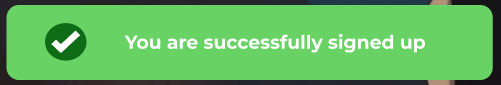

# MovieGeek Booking Website

MovieGeek Booking Website is a full-stack application created using HTML, CSS, JS, Python, Django and Bootstrap. It is a movie ticket booking web application that allows users to view showtimes and book tickets for 4 featured new release movies. Customers can select a movie, showtime, number of seats, and complete booking checkout. The site provides an easy way to reserve seats and books tickets online.

View the live project

Screenshot

## Table of Contents

- [UX](#ux)
    - [Target Audience](#target-audience)
    - [Key Project Goals](#key-project-goals)
    - [User Stories](#user-stories)
    - [Agile Methodology](#agile-methodology)
- [UI](#ui)
    - [Initial Design](#design)
    - [Colour Palette](#colour-palette)
    - [Typography](#typography)
- [Logic](#logic)
- [Features](#features)
    - [Existing Features](#existing-features)
    - [Features Left to Implement](#features-left-to-implement)
- [Error Handling](#error-handling)
- [Technologies Used](#technologies-used)
- [Deployment](#deployment)
    - [Database (ElephangSQL)](#database-elephangsql)
    - [Cloudinary](#cloudinary)
    - [Django secret key](#django-secret-key)
    - [Heroku](#heroku)
    - [How to Fork the Github Repository](#how-to-fork-the-github-repository)
    - [How to Clone the Github Repository](#how-to-clone-the-github-repository)
- [Credits](#credits)
    - [Content](#content)
    - [Media](#media)
    - [Code](#code)
- [Acknowledgements](#acknowledgements)

## UX

### Target Audience

The primary audience is moviegoers and cinephiles looking to conveniently book tickets online for upcoming movie releases. This includes casual movie fans, friends/family planning a night out, as well as frequent moviegoers who attend opening weekends. The focus is providing quick booking for the latest films.

### Key Project Goals

- Allow users to search for and view information about movies playing, including title, showtimes, ticket prices, and seat availability.
- Provide users with a personal profile where they can view their past and current bookings.
- Integrate a ticketing system that updates seat availability in real-time as tickets are booked.
- Implement a seamless mobile-friendly booking flow for smartphone users.
- Build an admin portal where staff can manage movie and showtime listings.

### User Stories

### Agile Methodology

## UI

### Initial Design

After discussing wireframes with my mentor, we determined that visual mockups were not necessary for this project. Since my designs thoroughly document the website's functionality and features in detail, comprehensive wireframes would be redundant.

The sizes that were used for the design:

* Mobile (360x740)
* Tablet (768x1024)
* Desktop (1440x1024)

#### Header (Authenticated User)

<details><summary><b>Header (Authenticated User)</b></summary>


</details>

Things I have changed:

#### Header (Non-Authenticated User)
<details><summary><b>Header (Non-Authenticated User)</b></summary>


</details>

Things I have changed:

#### Footer
<details><summary><b>Footer</b></summary>


</details>

Things I have changed:

#### Sign Up page
<details><summary><b>Sign Up page</b></summary>


</details>

Things I have changed:

#### Log In page
<details><summary><b>Log In page</b></summary>


</details>

Things I have changed:

#### Home page (Authenticated User)
<details><summary><b>Home page (Authenticated User)</b></summary>


</details>

Things I have changed:

#### Home page (Non-Authenticated User)
<details><summary><b>Home page (Non-Authenticated User)</b></summary>


</details>

Things I have changed:

#### Booking page
<details><summary><b>Booking page</b></summary>


</details>
<details><summary><b>Booking page</b></summary>


</details>

Things I have changed:

#### Booking Confirmation page
<details><summary><b>Booking Confirmation page</b></summary>


</details>

Things I have changed:

#### Profile page (with bookings)
<details><summary><b>Profile page (with bookings)</b></summary>


</details>

Things I have changed:

#### Profile page (without bookings)
<details><summary><b>Profile page (without bookings)</b></summary>


</details>

Things I have changed:

#### Log Out page
<details><summary><b>Log Out page</b></summary>


</details>

Things I have changed:

#### Messages
<details><summary><b>Sign Up</b></summary>


</details>

<details><summary><b>Log In</b></summary>


</details>

<details><summary><b>Edit booking</b></summary>


</details>

<details><summary><b>Delete booking</b></summary>


</details>

<details><summary><b>Log Out</b></summary>


</details>

Things I have changed:

#### Modals
<details><summary><b>Delete booking confirmation</b></summary>


</details>

### Colour Palette


For this project, I chose these colors to be presented in my colour palette as they have a positive affect on the user experince.


I also used black, white and green colours mostly for text or as a background colours. RGB colours such as rgba(0,0,0,0.65), rgba (255, 255, 255, .6), and rgba(0, 0, 0, .3) were used for an overlay.

### Typography

For this project I used Montserrat font family as I thought it was a readable font and would be beneficial to user experience.

## Logic

## Features

### Existing Features

#### Header (Authenticated User)

<details><summary><b>Header (Authenticated User)</b></summary>


</details>

If the user is authenticated, they will see Home, Profile and Log Out links in the navigation menu which gives them ability to go through the available movies and book them, go to their Profile page and see the bookings they have there or make a new one. They also can log out from their account and will be redirected to the Home page.

#### Header (Non-Authenticated User)
<details><summary><b>Header (Non-Authenticated User)</b></summary>


</details>

If the user is not authenticated, they will see Home, Sign Up and Log In links in the navigation menu which gives them ability to go through the availbale movies and watch trailers, sign up as a new user or log in as an existing one.

#### Footer
<details><summary><b>Footer</b></summary>


</details>

The footer includes links to the social media that each opens in a new tab and "Admin Only" button which is available only to the superuser/admin of the website.

#### Sign Up page
<details><summary><b>Sign Up page</b></summary>


</details>

The sign up page gives user ability to enter their information(username, email address, password and confirm password) in order to authorise them as a website user and give them ability to create, view, edit and delete their bookings.

#### Log In page
<details><summary><b>Log In page</b></summary>


</details>

The log in page gives user ability to enter their information(username and password) in order to get access to their existing profile and give them ability to create, view, edit and delete their bookings.

#### Home page (Authenticated User)
<details><summary><b>Home page (Authenticated User)</b></summary>


</details>

If the user is authenticated, they will see the welcome message with their username and "My bookings" button that will redirect them to their Profile page where they can manage their bookings. They have an ability to go through the available movies and book them as well as watch trailers.

#### Home page (Non-Authenticated User)
<details><summary><b>Home page (Non-Authenticated User)</b></summary>


</details>

If the user is not authenticated, they will see the general welcome message and information about the website. They can watch trailers but don't have an ability to book movies and if they click on "Book Now" button will redicted to Log In page.

#### Booking page (Create booking)
<details><summary><b>Booking page</b></summary>


</details>
<details><summary><b>Booking page</b></summary>


</details>

The booking page includes a dropdown with four movies to choose from, the numbers of seats you can select, date and time, and price which populates depending on how many tickets the user will choose with "Book" button.

#### Booking Confirmation page
<details><summary><b>Booking Confirmation page</b></summary>


</details>

After the user did their booking, they will be redirected to the "Booking confirmation" page that confirm that their booking was successful. They also have an option to either see their newly creayed booking in their Profile page or go back to the Home page.

#### Profile page (with bookings) (View booking)
<details><summary><b>Profile page (with bookings)</b></summary>


</details>

The Profile page with existing bookings includes information about the user (username and email address) as well as information about their bookings. Each booking has the date and time of movie being screened, movie title, an amount of seats, price as well as "Edit" and "Delete" buttons so that the user can change their booking or delete it completely.

#### Profile page (without bookings)
<details><summary><b>Profile page (without bookings)</b></summary>


</details>

The Profile page without bookings includes the text with "No bookings yet" and "Book a Movie" button that gives the user an ability to book a movie.

#### Edit booking
<details><summary><b>Edit booking</b></summary>


</details>

User can edit their booking and will be presented with a page identical to the Booking page but with functionality to change their booking and "Update" button to save their changes. The message about their booking being changed is displayed.

#### Delete booking
<details><summary><b>Delete booking</b></summary>


</details>

User can delet their booking and will be presented with a modal to confirm the delete process. The message about their booking being changed is displayed.

#### Admin panel
<details><summary><b>Admin panel</b></summary>


</details>

Although, the Django admin panel is not created by me, it's still plays the most important part for the website. In my admin panel, I have two models: Booking and Movie and I also use the default User model.

#### Log Out page
<details><summary><b>Log Out page</b></summary>


</details>

The Log Out page gives the user the ability to log out from their account. After logging out they will be redirected to the Home page.

#### Messages
<details><summary><b>Sign Up</b></summary>


</details>

<details><summary><b>Log In</b></summary>


</details>

<details><summary><b>Edit booking</b></summary>


</details>

<details><summary><b>Delete booking</b></summary>


</details>

<details><summary><b>Log Out</b></summary>


</details>

Each of the alert messages being displayed when the various actions such as Sign In, Log In, Log Out, Create, Edit or Delete a booking is being done to give a visual feedback to the user. The user can close the message or it will dissapear in a few seconds.

#### Modals
<details><summary><b>Delete booking confirmation</b></summary>


</details>

I used a Bootstrap modal for the delete booking confirmation as it is essential for good UX. When the user clicks on "Delete" button, their booking is deleted from the database.

### Features Left to Implement

## Error Handling

## Technologies Used

* [Figma](https://www.figma.com/) was used to create the final design of a website.
* [Font Awesome](https://fontawesome.com/) was used for social media icons in the footer.
* [Iconify](https://iconify.design/) was used for Question Marl icon in the header.
* [Favicon](https://favicon.io/) was used for favicons.
* [Google Fonts](https://fonts.google.com/) was used to add specific font family to the stylesheet.
* [Adobe Color](https://color.adobe.com/create/color-wheel) was used to create a colour palette.
* [VSCode](https://code.visualstudio.com/) was used to code the website.
* [W3C validation](https://validator.w3.org/) was used to check the markup validity of html file.
* [Jigsaw](https://jigsaw.w3.org/css-validator/) was used to check the validity of css file.
* [JSHint](https://jshint.com/) was used to check the validity of css file.
* [Am I Responsive](https://ui.dev/amiresponsive) was used to get a screenshot of a final look of the website on various devices.
* [Github](https://github.com/) was used to store the code of the website.
* Chrome DevTools was used to check the responsiveness of the website as well as to debug it.
* Chrome's Developer Tool Lighthouse was used to check the performance of the website.

## Deployment

Right after finishing the Django setup, the app was deployed to Heroku for the first time to confirm all was working as expected.

### Database (ElephangSQL)

1. Navitate to [ElephantSQL website](https://www.elephantsql.com/), log in to your account
2. Click “Create New Instance”.
3. Enter database name, leave plan field as it is. You can leave the Tags field blank.
4. Select region, click on "Review".
5. Check that your details are correct. Then click “Create instance”
6. Return to the ElephantSQL dashboard and click on the database instance name for this project.
7. Copy your ElephantSQL database URL using the Copy.
8. Paste this URL into env.py file as DATABASE_URL value and save the file.

```
os.environ["DATABASE_URL"] = "postgres://yourdatabaseURL"
```

### Cloudinary

1. Navigate to https://cloudinary.com/ and log in to your account.
2. Navigate to dashboard/console https://console.cloudinary.com/console/ and copy API Enviroment variable starting with "cloudinary://".
3. Paste copied url into env.py file as CLOUDINARY_URL value and save the file.

```
os.environ["CLOUDINARY_URL"] = "cloudinary://yourAPIEnviromentvariable"
```

### Django secret key

You need to include you Django secret key that you can generate using any of the Django secret keys generators online.
In order to protect django app secret key it was set as an enviroment variable and stored in env.py.

```
os.environ["SECRET_KEY"] = "yourSecretKey"
```
### Heroku

1. Log in to Heroku or create an account.
2. Navigate to your Heroku dashboard, click "New" and select "Create new app".
3. Enter a name for your app (can be a name of your project) and choose the region that suits best to your location.
4. Select "Settings" from the tabs.
5. Click "Reveal Config Vars".
6. These are:
CLOUDINARY_API_KEY - Get from Cloudinary.
DATABASE_URL - Get from your SQL provider.
DEBUG - Leave blank for False, any value for True.
DISABLE_COLLECTSTATIC - Set to '0' (without '')
SECRET_KEY - This is your Django project secret key, generated by your Django project. You can generate a new key that is different from your localhost version.
7. Select "Deploy" from the tabs.
8. Select "GitHub - Connect to GitHub" from deployment methods.
9. Click "Connect to GitHub" in the created section.
10. Search for the GitHub repository by name.
11. Click to 'Connect' to the relevant repo.
12. Either click ‘Enable Automatic Deploys’ for automatic deploys or ‘Deploy Branch’ to deploy manually. Manually deployed branches will need re-deploying each time the repo is updated.
13. Click 'View' to view the deployed site.

### How to Fork the Github Repository

1. If you want to fork the repository log in to Github or create an account.
2. Locate to the repository for the project.
3. In the top right corner click on 'Fork' button. 
4. Now you have a copy of the original repository in your Github account.

### How to Clone the Github Repository

1. If you want to clone the repository log in to Github or create an account.
2. Go to the main page of the repository.
3. Click on '<> Code' and copy the URL from HTTPS.
4. Open Git Bash.
5. Change your current working directory to the location where you want your clone to be made.
6. Type 'git clone' into your terminal window, paste the URL you copied earlier and press Enter to create your local clone.

## Credits

### Content

* The text content for the Home section was created by me.
* Movies description was taken from IMDB website (in order):
  1. [Spider-Man: Across The Spider-Verse](https://www.imdb.com/title/tt9362722/?ref_=nv_sr_srsg_0_tt_8_nm_0_q_spider)
  2. [Barbie](https://www.imdb.com/title/tt1517268/?ref_=nv_sr_srsg_2_tt_3_nm_3_q_ba)
  3. [Mission Impossible: Dead Reckoning Part One](https://www.imdb.com/title/tt9603212/)
  4. [Oppenheimer](https://www.imdb.com/title/tt15398776/?ref_=nv_sr_srsg_0_tt_7_nm_1_q_opp)

### Media

* The hero image was taken from [here](https://www.pinterest.com.au/pin/589408669974067553/).
* The favicon image was taken from [here](https://www.goodgoodgood.co/articles/positive-words-that-start-with-m).
* Movies posters (in order):
  1. [Spider-Man: Across The Spider-Verse](https://www.imdb.com/title/tt9362722/)
  2. [Barbie](https://deadline.com/gallery/barbie-movie-posters/barbie-barbie_vert_tsr_w_talent_2764x4096_dom_rgb/)
  3. [Mission Impossible: Dead Reckoning Part One](https://www.imdb.com/title/tt9603212/)
  4. [Oppenheimer](https://www.imdb.com/title/tt15398776/)

### Code

* The initial deployment, js code for alert messages, information on how to create models as well as how to add authorisation to my project were taken from [Code Institute's I Think Therefore I Blog](https://learn.codeinstitute.net/courses/course-v1:CodeInstitute+FST101+2021_T1/courseware/b31493372e764469823578613d11036b/9236975633b64a12a61a00e0cca7c47d/)

## Acknowledgements

I express my sincere gratitude to my mentor, Dick Vlaanderen, for his invaluable assistance and feedback during the entire project. Additionally, I extend my thanks to our facilitator, Marko Tot, for his guidance on the material and practical advice. Special appreciation goes to my fellow groupmate, Gbemi Akadiri, for his steadfast help and support throughout the project.


