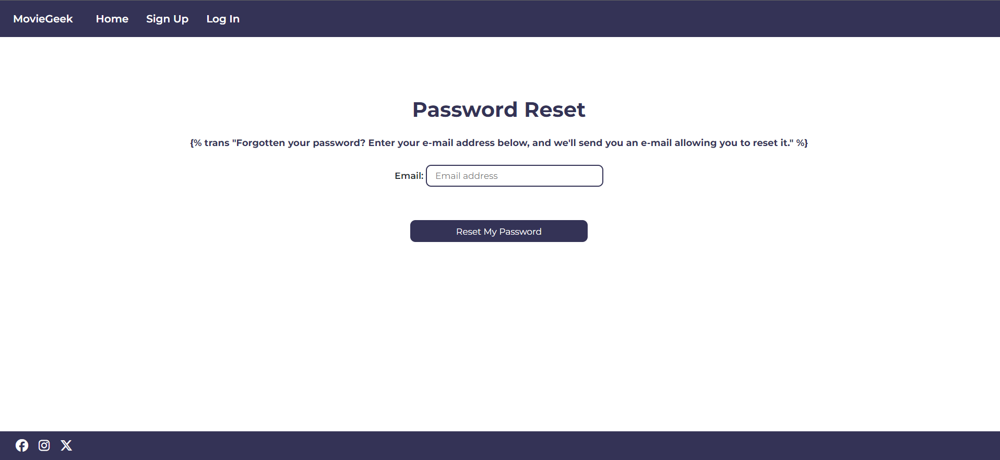
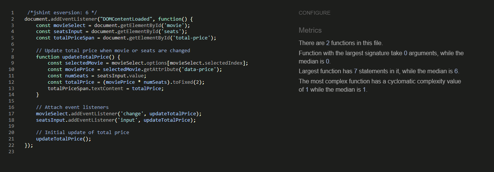
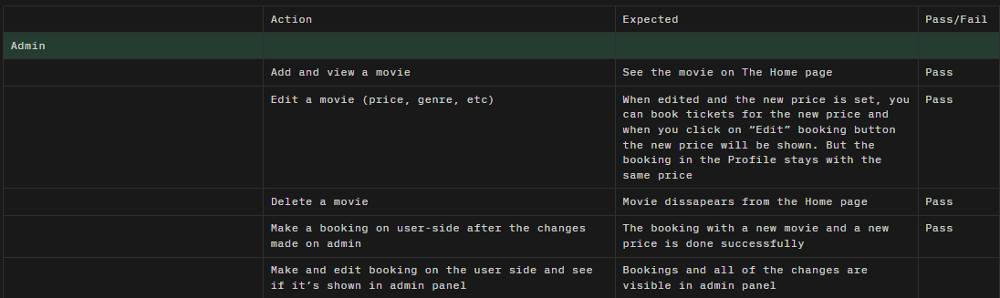
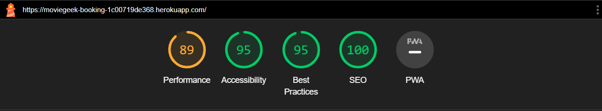
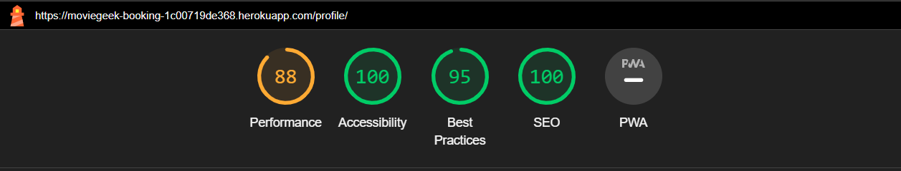

# MovieGeek Booking Website

Back to [README](README.md)

## Testing Overview

## Table of Contents

- [User Story Tests](#user-story-tests)
- [Validator Testing](#validator-testing)
    - [HTML](#html)
    - [CSS](#css)
    - [JS](#javascript)
    - [Python](#python)
- [Unit Testing](#unit-testing)
    - [Coverage](#coverage)
- [Error Handling](#error-handling)
- [Manual Testing](#manual-testing)
    - [SEO](#seo)
    - [Accessibility](#accessibility)
        - [Lighthouse](#lighthouse)
        - [Responsiveness](#responsiveness)
        - [Browser compatibility](#browser-compatibility)
- [Bugs](#bugs)
    - [Solved](#solved)
    - [Unsolved](#unsolved)

## User Story Tests

| User Story | Screenshot |
| --- | --- |
| As a user I can access main pages and features through the header and footer so that I can easily navigate the site (Authenticated User) |  |
| As a user I can access main pages and features through the header and footer so that I can easily navigate the site (Non-Authenticated User) |  |
| As a user I can access main pages and features through the header and footer so that I can easily navigate the site (Footer) |  |
| As a new user, I can sign up with form validation so that I can create a new account to book movies. |  |
| As a user I can login so that I can access my account. |  |
| As a user I can reset my password by entering my email so that I can recover access if forgotten. |  |
| As a user I can select a movie, date, time, and up to 8 seats so that I can book tickets and see them in "My bookings". |  |
| As a user I can edit or delete my existing bookings on my profile so that I can manage my tickets. (Edit) |  |
| As a user I can edit or delete my existing bookings on my profile so that I can manage my tickets. (Delete) |  |
| As a user I can view information about movies so that I can choose movie to book tickets to. |  |
| As a user I can view my profile containing my details so that I can confirm my account information. |  |
| As a a logged in user I can log out so that I can securely end my session. |  |
| As a user, I can see customized and informative error pages for 404 and 500 errors so that I understand what happened and can take appropriate action. |  |
| As a user, I can see customized and informative error pages for 404 and 500 errors so that I understand what happened and can take appropriate action. |  |
| As a site owner/administrator I can create, read, update and delete movies so that I can manage showtime content. (Create) |  |
| As a site owner/administrator I can create, read, update and delete movies so that I can manage showtime content. (Read) |  |
| As a site owner/administrator I can create, read, update and delete movies so that I can manage showtime content. (Update) |  |
| As a site owner/administrator I can create, read, update and delete movies so that I can manage showtime content. (Delete) |  |

## Validator Testing

### HTML

[W3C validation](https://validator.w3.org/) was used to check the markup validity of html file.

<details><summary><b>Home page (base.html and index.html)</b></summary>


</details>
<details><summary><b>Profile page (profile.html)</b></summary>


</details>
<details><summary><b>Booking (booking.html)</b></summary>


</details>
<details><summary><b>Edit booking (edit_booking.html)</b></summary>


</details>
<details><summary><b>Booking confirmation (boooking_confirmation.html)</b></summary>


</details>
<details><summary><b>Password Reset (password_reset.html)</b></summary>


</details>
<details><summary><b>Password Reset Done(password_reset_done.html)</b></summary>


</details>
<details><summary><b>Password Reset From Key (password_reset_from_key.html)</b></summary>


</details>
<details><summary><b>Password Reset From Key Done(password_reset_from_key_done.html)</b></summary>


</details>

The rest of the pages and folders that are in Github like: socialaccount, etc. weren't used by me and thus weren't validated.

### CSS

[Jigsaw](https://jigsaw.w3.org/css-validator/) was used to check the validity of css file.

<details><summary><b>style.css</b></summary>


</details>

### JavaScript

[JSHint](https://jshint.com/) was used for validation.

<details><summary><b>script.js</b></summary>


</details>
<details><summary><b>base.js</b></summary>


</details>
<details><summary><b>booking.js</b></summary>


</details>

No errors in all the files.

### Python

[CI Python Linter](https://pep8ci.herokuapp.com/) was used to check the validity of python files.

<details><summary><b>asgi.py</b></summary>


</details>
<details><summary><b>wsgi.py</b></summary>


</details>
<details><summary><b>urls.py (moviegeek)</b></summary>


</details>
<details><summary><b>urls.py (booking)</b></summary>


</details>
<details><summary><b>views.py (moviegeek)</b></summary>


</details>
<details><summary><b>views.py (booking)</b></summary>


</details>
<details><summary><b>test_forms.py</b></summary>


</details>
<details><summary><b>test_models.py</b></summary>


</details>
<details><summary><b>test_views.py</b></summary>


</details>
<details><summary><b>forms.py</b></summary>


</details>
<details><summary><b>models.py</b></summary>


</details>
<details><summary><b>admin.py</b></summary>


</details>
<details><summary><b>apps.py</b></summary>


</details>

## Unit Testing

### Coverage

In order to run the tests, I ran the following command in the terminal each time:

`python3 manage.py test name-of-app `

To create the coverage report, I would then run the following commands:

`coverage run --source=name-of-app manage.py test`

`coverage report`

To see the HTML version of the reports, and find out whether some pieces of code were missing, I ran the following commands:

`coverage html`

`python3 -m http.server`

#### Booking app

12 tests were ran.


## Error Handling

### Error Pages Testing

<details><summary><b>500 Internal Server Error</b></summary>


</details>

To test if the 500 page is working, I tried to reset the password and because at that time I haven't add my credentials to Config Vars on Heroku, it was showing 500 error page.

<details><summary><b>404 Page Not Found</b></summary>


</details>

To test if the 404 page is working, I just typed in a non-existent url.

## Manual Testing




### SEO

Meta tags were included in a head of base.html file to tell the search engines and users more about the website and the information it contains.


### Accessibility

To ensure that the website was accessible to all users the following steps were taken:

* All the images has clear alt attribute that explains what it is about.
* Aria-labels were included to all the internal and external links to provide the purpose for them for screen readers.

### Lighthouse

After deploying to Heroku, the lighthouse for error pages is not loaded.

##### Mobile

| Page | Size | Screenshot |
| ---  | ---  | --- |
| Home | Mobile |  |
| Profile | Mobile |  |
| Booking | Mobile |  |
| Edit booking | Mobile |  |
| Sign Up | Mobile |  |
| Log In | Mobile |  |
| Log Out | Mobile |  |
| Booking confirmation | Mobile |  |
| Password Reset | Mobile |  |
| Password Reset Done | Mobile |  |
| Password Reset From Key | Mobile |  |
| Password Reset From Key Done | Mobile |  |

##### Desktop

| Page | Size | Screenshot |
| ---  | ---  | --- |
| Home | Desktop |  |
| Profile | Desktop |  |
| Booking | Desktop |  |
| Edit booking | Desktop |  |
| Sign Up | Desktop |  |
| Log In | Desktop |  |
| Log Out | Desktop |  |
| Booking confirmation | Desktop |  |
| Password Reset | Desktop |  |
| Password Reset Done | Desktop |  |
| Password Reset From Key | Desktop |  |
| Password Reset From Key Done |Desktop |  |

### Responsiveness

Responsiveness is tested on various devices such as:

<details><summary><b>Samsung Galaxy S8+</b></summary>


</details>
<details><summary><b>Samsung Galaxy A34</b></summary>


</details>
<details><summary><b>Oppo A12</b></summary>


</details>
<details><summary><b>Xiaomi 12T Pro</b></summary>


</details>
<details><summary><b>IPad</b></summary>


</details>
<details><summary><b>Acer Nitro</b></summary>


</details>

### Browser compatibility

| Browser | Fail/Pass | Screenshot |
| ---  | ---  | --- |
| Chrome | Pass |  |
| Edge | Pass |  |
| Opera | Pass |  |
| Firefox | Pass |  |

## Bugs

### Solved

* The information about the booking when click on "Edit" button was not displayed properly. I fixed by adding `"date:"Y-m-d""` and `"date:"H:i""` to `form.instance.date` and `form.instance.time`


* I changed `alert.close()` to `messages.remove()` in js code for Bootstrap alert messages as it was throwing an error in the console.


* Bootstrap alert messages were also hidden under my header element and I fixed it by adding `z-index: 1000` to the container they are in.

* In edit_booking.html where the user was manually entering the number of tickets, the `total-price` was showing `NaN` first if there is no numbers in the input. I fixed by adding `data-price="{{ movie.price }}"` to my template and modifying js code for that.

```javascript
// Update total price when movie or seats are changed
  function updateTotalPrice() {
      const selectedMovie = movieSelect.options[movieSelect.selectedIndex];
      const moviePrice = selectedMovie.getAttribute('data-price');
      const numSeats = seatsInput.value;
      const totalPrice = (moviePrice * numSeats).toFixed(2);
      totalPriceSpan.textContent = totalPrice;
  }
```

### Unsolved

* I had a problem with navbar toggle still appearing on 1024x768 size, even with `display: none` for `(min-width: 992px)`, so I fixed it by adding `(min-width: 1024px)` to media queries. It still can be visible a little bit if you are testing sizes manually.
* The "Change Password" input and labels were suppose to go one after another but they are next to each other, and although I tried to modify it using different styles, it still doesn't work.


* I have a problem with the number input in booking.html, although I put max and min value in the input when you manually entering the numbers, you can enter any number you want. You can't book the seats as their is validation present.


* To test if the 403 page is working, I logged in as a user Grace and click on "Edit" button on one of her bookings, then I copied that the link of that page, log out as Grace and log in as another user called Michael, then I pasted in the link that I copied before and see if the user "Michael" can edit booking of the user "Grace". It was showing me 403 error page, as it's forbidden access and one user can't edit the booking of another. But now it's showing me 404 error page or 500 error page if the user tries to paste in the link without being logged in and signed up.


