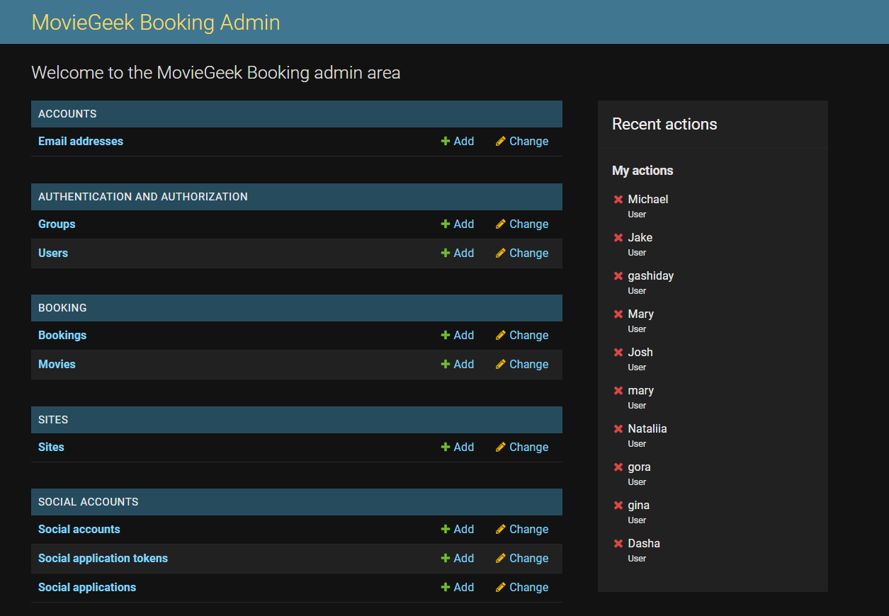

# MovieGeek Booking Website

## Testing Overview

## Table of Contents

- [User Story Tests](#user-story-tests)
- [Validator Testing](#validator-testing)
    - [HTML](#html)
    - [CSS](#css)
    - [JS](#javascript)
    - [Python](#python)
- [Unit Testing](#unit-testing)
    - [Coverage](#coverage)
- [Error Handling](#error-handling)
- [Manual Testing](#manual-testing)
    - [SEO](#seo)
    - [Accessibility](#accessibility)
        - [Lighthouse](#lighthouse)
        - [Responsiveness](#responsiveness)
        - [Browser compatibility](#browser-compatibility)
- [Bugs](#bugs)
    - [Solved](#solved)
    - [Unsolved](#unsolved)

## User Story Tests

| User Story | Screenshot |
| --- | --- |
| As a user I can access main pages and features through the header and footer so that I can easily navigate the site (Authenticated User) |  |
| As a user I can access main pages and features through the header and footer so that I can easily navigate the site (Authenticated User) |  |
| As a user I can access main pages and features through the header and footer so that I can easily navigate the site (Non-Authenticated User) |  |
| As a new user, I can sign up with form validation so that I can create a new account to book movies. |  |
| As a user I can login so that I can access my account. |  |
| As a user I can select a movie, date, time, and up to 8 seats so that I can book tickets and see them in "My bookings". |  |
| As a user I can edit or delete my existing bookings on my profile so that I can manage my tickets. (Edit) |  |
| As a user I can edit or delete my existing bookings on my profile so that I can manage my tickets. (Delete) |  |
| As a user I can view information about movies so that I can choose movie to book tickets to. |  |
| As a user I can view my profile containing my details so that I can confirm my account information. |  |
| As a a logged in user I can log out so that I can securely end my session. |  |
| As a site owner/administrator I can create, read, update and delete movies so that I can manage showtime content. |  |

## Validator Testing

### HTML

<b>base.html</b>

<b>index.html</b>

<b>booking.html</b>

<b>booking_confirmation.html</b>

<b>edit_booking.html</b>

<b>profile.html</b>

<b>signup.html</b>

<b>login.html</b>

<b>logout.html</b>

### CSS

<b>style.css</b>

### JavaScript

<b>script.js</b>

### Python

<b>logout.html</b>

## Unit Testing

### Coverage

## Error Handling

## Manual Testing

### SEO

### Accessibility

#### Lighthouse

#### Responsiveness

#### Browser compatibility

## Bugs

### Solved

### Unsolved